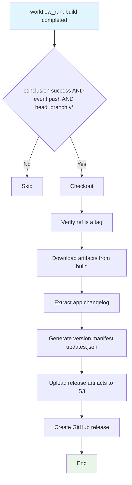

## Workflow Overview

**Purpose**: Based on a completed App Build run for a `v*` tag, download the build artifacts, generate a Tauri updater `updates.json` manifest, upload artifacts to an S3-compatible object store, and create a GitHub Release.

**Trigger Events**: `workflow_run` — when the `Modrinth App build` workflow completes successfully for a `push` event whose `head_branch` starts with `v`.

**Target Environments**: Production (`prod`); no environment input exposed to workflow_dispatch.

## Execution Flow Diagram



## Jobs & Dependencies

| Job Name | Purpose | Dependencies | Execution Context |
|----------|---------|--------------|-------------------|
| release | Assemble + publish production release | Downstream of build workflow's successful `v*` tag run | `namespace-profile-medium-amd64` |

## Requirements Matrix

### Functional Requirements

| ID | Requirement | Priority | Acceptance Criteria |
|----|-------------|----------|-------------------|
| REQ-001 | Only act on successful `v*` tag pushes | High | Guardian `if` blocks all other conclusions/events/branches |
| REQ-002 | Verify tag points at build head SHA | High | `gh api` ref check passes; error+exit on mismatch |
| REQ-003 | Download the 3 platform artifacts | High | `action-download-artifact` pulls all `App bundle (*)` |
| REQ-004 | Generate valid Tauri `updates.json` | High | Manifest matches Tauri updater server schema |
| REQ-005 | Upload to S3 with correct layout | High | Artifacts land under `versions/<version>/<platform>` |
| REQ-006 | Create a GitHub Release | High | Release with title `Modrinth App <VERSION>` and 5 installer assets |

### Security Requirements

| ID | Requirement | Implementation Constraint |
|----|-------------|---------------------------|
| SEC-001 | S3 credentials not leaked | Passed only via `env` to the upload step |
| SEC-002 | No signing keys handled | Release consumes pre-signed artifacts; only build workflow holds signing keys |

### Performance Requirements

| ID | Metric | Target | Measurement Method |
|----|-------|--------|-------------------|
| PERF-001 | Download+upload duration | Bounded by artifact size; `use_unzip: true` | Worker logs |

## Input/Output Contracts

### Inputs

```yaml
# Environment Variables (release job scope)
VERSION_TAG: string  # Purpose: branch of triggering build (e.g. v1.2.3) — from workflow_run.head_branch
LINUX_X64_BUNDLE_ARTIFACT_NAME: string  # Purpose: 'App bundle (x86_64-unknown-linux-gnu)'
WINDOWS_X64_BUNDLE_ARTIFACT_NAME: string  # Purpose: 'App bundle (x86_64-pc-windows-msvc)'
MACOS_UNIVERSAL_BUNDLE_ARTIFACT_NAME: string  # Purpose: 'App bundle (universal-apple-darwin)'
LAUNCHER_FILES_BUCKET_BASE_URL: string
  # Purpose: base URL for updater URLs. HARDCODED to https://launcher-files.modrinth.com (recorded as CURRENT behavior)

# Secrets
GH_TOKEN: github.token  # Purpose: tag verification, release notes, gh release
```

### Outputs

```yaml
# Outputs
updates.json: file  # Description: Tauri updater manifest (version, notes, pub_date, platforms with signatures/urls)
github_release: release  # Description: named Modrinth App <VERSION>, 5 installer assets
s3_objects: bucket  # Description: versions/<ver>/{macos,linux,windows}/* + updates.json at bucket root
```

### Artifact Naming & Globs

The workflow depends on an exact set of "Modrinth App..." artifact filename patterns. `VERSION` is the tag with the leading `v` stripped (e.g. `1.2.3`). These are the precise strings the release relies on across the signature files, `updates.json` platform entries, and `gh release` asset args.

| File Pattern | Role | Platforms / Usage |
|--------------|------|-------------------|
| `Modrinth App.app.tar.gz.sig` | Updates signature (macOS) | `darwin-aarch64` + `darwin-x86_64` `signature` |
| `Modrinth App_${VERSION}_amd64.AppImage.tar.gz.sig` | Updates signature (Linux) | `linux-x86_64` `signature` |
| `Modrinth App_${VERSION}_x64-setup.nsis.zip.sig` | Updates signature (Windows) | `windows-x86_64` `signature` |
| `Modrinth App.app.tar.gz` | Updates URL (macOS) | `darwin-aarch64` + `darwin-x86_64` `url` |
| `Modrinth App_${VERSION}_amd64.AppImage.tar.gz` | Updates URL (Linux) | `linux-x86_64` `url` |
| `Modrinth App_${VERSION}_x64-setup.nsis.zip` | Updates URL (Windows) | `windows-x86_64` `url` |
| `Modrinth App_${VERSION}_universal.dmg` | Install URL (macOS) + release asset | `darwin-*` `install_urls`; `gh release` asset |
| `Modrinth App_${VERSION}_amd64.deb` | Install URL (Linux) + release asset | `linux-x86_64` `install_urls`; `gh release` asset |
| `Modrinth App_${VERSION}_amd64.AppImage` | Install URL (Linux) + release asset | `linux-x86_64` `install_urls`; `gh release` asset |
| `Modrinth App-${VERSION}-1.x86_64.rpm` | Install URL (Linux) + release asset | `linux-x86_64` `install_urls`; `gh release` asset |
| `Modrinth App_${VERSION}_x64-setup.exe` | Install URL (Windows) + release asset | `windows-x86_64` `install_urls`; `gh release` asset |

Counts by role: 3 signature files, 3 `updates.json` `url` values, 6 `install_urls` (macOS 1, Linux 3, Windows 1), 5 `gh release` assets. The 5 release assets are a subset of the install_urls set.

### Secrets & Variables

| Type | Name | Purpose | Scope |
|------|------|---------|-------|
| Secret | LAUNCHER_FILES_BUCKET_ACCESS_KEY_ID | S3 upload | upload step |
| Secret | LAUNCHER_FILES_BUCKET_SECRET_ACCESS_KEY | S3 upload | upload step |
| Secret | LAUNCHER_FILES_BUCKET_NAME | S3 bucket | upload step |
| Secret | LAUNCHER_FILES_BUCKET_REGION | S3 region | upload step |
| Secret | LAUNCHER_FILES_BUCKET_ENDPOINT_URL | S3 endpoint (Workaround: R2-compatible checksum) | upload step |

## Execution Constraints

### Runtime Constraints

- **Timeout**: Default GitHub Action job timeout (not set explicitly)
- **Concurrency**: `concurrency` group `${{ github.workflow }}-${{ github.ref }}`; `cancel-in-progress: true` except on `main`/`prod`
- **Resource Limits**: None explicit; artifacts must fit runner disk

### Environmental Constraints

- **Runner Requirements**: Needs `jq`, `aws` CLI, `npx`, `gh` CLI (preinstalled on runner)
- **Network Access**: GitHub API, artifact download, S3-compatible object store (R2), npm for `tsx` transient
- **Permissions**: `GITHUB_TOKEN` for release creation + `GH_TOKEN` for API; S3 AWS credentials

## Error Handling Strategy

| Error Type | Response | Recovery Action |
|------------|----------|-----------------|
| Tag/SHA mismatch | `::error::` then `exit 1` | Re-trigger build/release; verify tag attach |
| Refresh: release notes generation | Uses `gh api` last release `published_at`; empty allowed | `// ""` fallback keeps job clean |
| Missing signature file ake (jq --rawfile) | `updates.json` generation fails | Verify artifact was uploaded with `.sig` |
| S3 upload failure | `aws s3 cp` fails the step | Re-run job (idempotent upload) |
| Non-tag branch completing build | Guardian `if` short-circuits job | No action (expected) |

## Quality Gates

### Gate Definitions

| Gate | Criteria | Bypass Conditions |
|------|----------|-------------------|
| Tag integrity | Head SHA matches tag object SHA | None (hard requirement) |
| Build conclusion | Preceding build run must be `success` | None |
| Manifest validity | `updates.json` produced by `jq` with all 4 platform signatures | None (fails otherwise) |

## Monitoring & Observability

### Key Metrics

- **Success Rate**: Release runs per published tag
- **Execution Time**: Download+upload minutes
- **Resource Usage**: Artifact disk/network

### Alerting

| Condition | Severity | Notification Target |
|-----------|----------|-------------------|
| Release failure | High | Repo owners (GitHub Actions) |

## Integration Points

### External Systems

| System | Integration Type | Data Exchange | SLA Requirements |
|--------|------------------|---------------|------------------|
| GitHub Releases | Create | `gh release create` with 5 assets | Must succeed on `v*` tag |
| S3-compatible object store (R2) | Upload | `versions/<ver>/{macos,linux,windows}` + `updates.json` | Checksum workaround flags `when_required` |
| Tauri updater | Consume | `updates.json` with per-platform signature/url/install_urls | URL base hardcoded |

### Dependent Workflows

| Workflow | Relationship | Trigger Mechanism |
|----------|--------------|-------------------|
| Modrinth App build | Upstream producer | Triggered via `workflow_run` chain |
| App Build artifacts | Input | `dawidd6/action-download-artifact` keyed to branch `VERSION_TAG` |

## Compliance & Governance

### Audit Requirements

- **Execution Logs**: GitHub Actions run logs
- **Approval Gates**: None (chain auto-triggers); implicit via release branch protection
- **Change Control**: PR review

### Security Controls

- **Access Control**: S3 creds scoped to upload step; `GH_TOKEN` for API
- **Secret Management**: AWS keys rotated externally
- **Vulnerability Scanning**: None in-workflow

## Edge Cases & Exceptions

### Scenario Matrix

| Scenario | Expected Behavior | Validation Method |
|----------|-------------------|-------------------|
| Build succeeds on non-tag branch | Release job skipped (guardian `if` fails) | Push main, observe no release |
| Build completes with `v` branch but is a PR/merge | Skipped (event must be `push`) | Verify `workflow_run.event == 'push'` |
| Tag points to older SHA | `::error::` + exit; no release | Force a fresh build on the tag |
| S3 object store checksum incompatibility | `AWS_*_CHECKSUM_*: when_required` workaround | Release works against R2 |
| Updates JSON for aarch64/x86_64 macOS | Both (aarch64 and x86_64) use same `universal-apple-darwin` app tar.gz + signature | Inspect `platforms` keys |

## Validation Criteria

### Workflow Validation

- **VLD-001**: Release only created when guardian `if` passes (success + push + v* head_branch)
- **VLD-002**: All 11 `Modrinth App...` artifact file patterns enumerated in [Artifact Naming & Globs](#artifact-naming--globs) download cleanly under their 3 `App bundle (*)` dirs (3 `.sig`, 3 `.tar.gz` updates URLs, 5 installer assets)
- **VLD-003**: `updates.json` contains version (no `v` prefix), notes, iso8601 pub_date, and 4 platform blocks
- **VLD-004**: `gh release create` uses `v`-prefixed tag and `Modrinth App <VERSION>` title with 5 assets

### Performance Benchmarks

- **PERF-001**: Upload of all platform bundles completes within job timeout
- **PERF-002**: `use_unzip: true` avoids duplicate expansion failures

## Change Management

### Update Process

1. **Specification Update**: Modify this document first
2. **Review & Approval**: PR review (DevOps)
3. **Implementation**: Apply changes to workflow
4. **Testing**: Dry-run on a staging tag
5. **Deployment**: Merge to main

### Version History

| Version | Date | Changes | Author |
|---------|------|---------|--------|
| 1.0 | 2026-08-27 | Initial specification (documents pre-rewrite `theseus-release.yml`) | DevOps Team |

## Related Specifications

- [spec-process-cicd-app-build.md](./spec-process-cicd-app-build.md)
- [spec-process-cicd-ci.md](./spec-process-cicd-ci.md)
