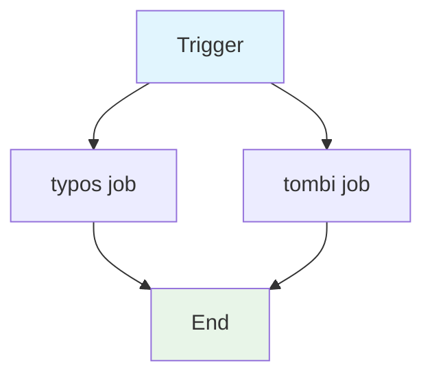

## Workflow Overview

**Purpose**: Run generic repository hygiene checks: typo detection (`typos`) and TOML lint/format (`tombi`).

**Trigger Events**:
- `pull_request`
- Push to `main`

**Target Environments**: CI.

## Execution Flow Diagram



## Jobs & Dependencies

| Job Name | Purpose | Dependencies | Execution Context |
|----------|---------|--------------|-------------------|
| typos | Detect spelling typos across repo | None | `ubuntu-latest` |
| tombi | Lint + format-check TOML files | None | `ubuntu-latest` |

## Requirements Matrix

### Functional Requirements

| ID | Requirement | Priority | Acceptance Criteria |
|----|-------------|----------|-------------------|
| REQ-001 | Detect typos in repo files | High | `typos` exits zero |
| REQ-002 | Validate TOML syntax | High | `tombi lint` exits zero |
| REQ-003 | Ensure TOML formatting | Medium | `tombi fmt --check` exits zero |

### Security Requirements

| ID | Requirement | Implementation Constraint |
|----|-------------|---------------------------|
| SEC-001 | No secrets used | None required |

### Performance Requirements

| ID | Metric | Target | Measurement Method |
|----|-------|--------|-------------------|
| PERF-001 | Fast hygiene checks | Quick; parallel jobs | Job duration |

## Input/Output Contracts

### Inputs

```yaml
# Environment Variables (global)
CARGO_TERM_COLOR: always  # Purpose: colored output for src tooling
SQLX_OFFLINE: true  # Purpose: offline SQLX

# Triggers
pull_request: any
branches: [main]
```

### Outputs

```yaml
# Side effects
typos_report: check  # Description: exit code reflects typo violations
tombi_report: check  # Description: exit code reflects TOML lint/format violations
```

### Secrets & Variables

| Type | Name | Purpose | Scope |
|------|------|---------|-------|
| - | - | No secrets or variables required | - |

## Execution Constraints

### Runtime Constraints

- **Timeout**: Default
- **Concurrency**: Two independent jobs run in parallel
- **Resource Limits**: Minimal

### Environmental Constraints

- **Runner Requirements**: `ubuntu-latest`
- **Network Access**: GitHub (binary install via `taiki-e/install-action`, `typos` action)
- **Permissions**: Default GITHUB_TOKEN

## Error Handling Strategy

| Error Type | Response | Recovery Action |
|------------|----------|-----------------|
| Typos found | Job fails | Fix typos (add to exception list if needed) |
| TOML lint/format fail | Job fails | Fix formatting/lint |

## Quality Gates

### Gate Definitions

| Gate | Criteria | Bypass Conditions |
|------|----------|-------------------|
| Typo hygiene | `typos` clean | None |
| TOML hygiene | `tombi lint` + `tombi fmt --check` clean | None |

## Monitoring & Observability

### Key Metrics

- **Success Rate**: job pass rate

### Alerting

| Condition | Severity | Notification Target |
|-----------|----------|-------------------|
| Hygiene check failure | Low-Medium | Repo owners (Actions) |

## Integration Points

### External Systems

| System | Integration Type | Data Exchange | SLA Requirements |
|--------|------------------|---------------|------------------|
| taiki-e/install-action | Binary install | tombi | Availability |
| crate-ci/typos | Action | typos binary | Availability |

### Dependent Workflows

| Workflow | Relationship | Trigger Mechanism |
|----------|--------------|-------------------|
| (none) | Standalone checks | - |

## Compliance & Governance

### Audit Requirements

- **Execution Logs**: GitHub Actions run logs
- **Approval Gates**: Branch protection
- **Change Control**: PR review

### Security Controls

- **Access Control**: Public runner
- **Secret Management**: None
- **Vulnerability Scanning**: Out of scope

## Edge Cases & Exceptions

### Scenario Matrix

| Scenario | Expected Behavior | Validation Method |
|----------|-------------------|-------------------|
| Valid TOML formatting | Both tombi steps pass | Run on formatted repo |
| Intentional typo in vendored/third-party | typos may flag | Configure/allow exception via config |

## Validation Criteria

### Workflow Validation

- **VLD-001**: Both `typos` and `tombi` pass on clean tree

### Performance Benchmarks

- **PERF-001**: Hygiene checks complete quickly (parallel jobs)

## Change Management

### Update Process

1. **Specification Update**: Modify this document first
2. **Review & Approval**: PR review
3. **Implementation**: Apply changes to workflow
4. **Testing**: Push/PR
5. **Deployment**: Merge to main

### Version History

| Version | Date | Changes | Author |
|---------|------|---------|--------|
| 1.0 | 2026-08-27 | Initial specification (documents `check-generic.yml`) | DevOps Team |

## Related Specifications

- [spec-process-cicd-check-rust.md](./spec-process-cicd-check-rust.md)
