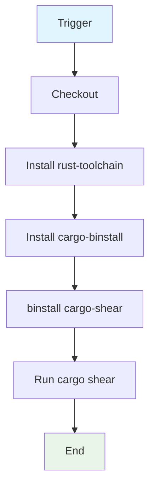

## Workflow Overview

**Purpose**: Detect and remove unused Rust package dependencies in the workspace via `cargo-shear`.

**Trigger Events**:
- `pull_request`
- Push to `main`

**Target Environments**: CI.

## Execution Flow Diagram



## Jobs & Dependencies

| Job Name | Purpose | Dependencies | Execution Context |
|----------|---------|--------------|-------------------|
| shear | Run unused-dependency detector | None | `ubuntu-latest` |

## Requirements Matrix

### Functional Requirements

| ID | Requirement | Priority | Acceptance Criteria |
|----|-------------|----------|-------------------|
| REQ-001 | Detect unused deps across workspace | High | `cargo shear` exits zero (no unused deps) |

### Security Requirements

| ID | Requirement | Implementation Constraint |
|----|-------------|---------------------------|
| SEC-001 | No secrets used | None required |

### Performance Requirements

| ID | Metric | Target | Measurement Method |
|----|-------|--------|-------------------|
| PERF-001 | Fast dependency audit | Minimal (single cargo invocation) | Run duration |

## Input/Output Contracts

### Inputs

```yaml
# Environment Variables (global)
CARGO_TERM_COLOR: always  # Purpose: colored cargo output
CARGO_INCREMENTAL: 0  # Purpose: disable incremental for deterministic run
SQLX_OFFLINE: true  # Purpose: offline SQLX (no DB needed)

# Triggers
pull_request: any
branches: [main]
```

### Outputs

```yaml
# Side effect
shear_report: check  # Description: exit code reflects unused-dependency violations
```

### Secrets & Variables

| Type | Name | Purpose | Scope |
|------|------|---------|-------|
| - | - | No secrets or variables required | - |

## Execution Constraints

### Runtime Constraints

- **Timeout**: Default
- **Concurrency**: None (single job)
- **Resource Limits**: Cargo build cache-free (incremental off)

### Environmental Constraints

- **Runner Requirements**: `ubuntu-latest`, stable Rust toolchain
- **Network Access**: crates.io (binstall + build)
- **Permissions**: Default GITHUB_TOKEN

## Error Handling Strategy

| Error Type | Response | Recovery Action |
|------------|----------|-----------------|
| shear detects unused deps | Step fails | Remove deps; rerun |
| Network/binstall failure | Step fails | Retry |

## Quality Gates

### Gate Definitions

| Gate | Criteria | Bypass Conditions |
|------|----------|-------------------|
| Dependency hygiene | `cargo shear` clean | None |

## Monitoring & Observability

### Key Metrics

- **Success Rate**: Run pass rate
- **Execution Time**: Seconds to low minutes

### Alerting

| Condition | Severity | Notification Target |
|-----------|----------|-------------------|
| shear failure | Low-Medium | Repo owners (Actions) |

## Integration Points

### External Systems

| System | Integration Type | Data Exchange | SLA Requirements |
|--------|------------------|---------------|------------------|
| crates.io | Package | cargo-shear binary via binstall | Availability |

### Dependent Workflows

| Workflow | Relationship | Trigger Mechanism |
|----------|--------------|-------------------|
| (none) | Standalone check | - |

## Compliance & Governance

### Audit Requirements

- **Execution Logs**: GitHub Actions run logs
- **Approval Gates**: Branch protection
- **Change Control**: PR review

### Security Controls

- **Access Control**: Public runner
- **Secret Management**: None
- **Vulnerability Scanning**: Out of scope (shear is deduplication, not CVE scan)

## Edge Cases & Exceptions

### Scenario Matrix

| Scenario | Expected Behavior | Validation Method |
|----------|-------------------|-------------------|
| Workspace with no unused deps | Check passes | Run on clean tree |
| Dependency conditionally used (target/feature gated) | shear may false-positive | Inspect detected dep |

## Validation Criteria

### Workflow Validation

- **VLD-001**: `cargo shear` runs with `SQLX_OFFLINE=true` and succeeds on clean tree

### Performance Benchmarks

- **PERF-001**: Audit completes without CI error

## Change Management

### Update Process

1. **Specification Update**: Modify this document first
2. **Review & Approval**: PR review
3. **Implementation**: Apply changes to workflow
4. **Testing**: Push/PR
5. **Deployment**: Merge to main

### Version History

| Version | Date | Changes | Author |
|---------|------|---------|--------|
| 1.0 | 2026-08-27 | Initial specification (documents `check-rust.yml`) | DevOps Team |

## Related Specifications

- [spec-process-cicd-check-generic.md](./spec-process-cicd-check-generic.md)
