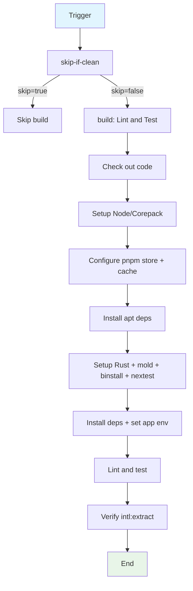

## Workflow Overview

**Purpose**: Run monorepo lint, test, and i18n checks on push/PR/merge_group. Supports the live branches (main) and PR-driven CI with a merge-queue diff-skip optimization.

**Trigger Events**:
- Push to `main`
- `pull_request` (opened, synchronize)
- `merge_group` (checks_requested)

**Target Environments**: CI (`ubuntu-latest` on GitHub-hosted runners).

## Execution Flow Diagram



## Jobs & Dependencies

| Job Name | Purpose | Dependencies | Execution Context |
|----------|---------|--------------|-------------------|
| skip-if-clean | Compute whether to skip (merge_queue no-diff) and whether run is internal | None | `ubuntu-latest` |
| build | Lint + test + i18n checks | `skip-if-clean` (outputs `skip`) | `ubuntu-latest` |

## Requirements Matrix

### Functional Requirements

| ID | Requirement | Priority | Acceptance Criteria |
|----|-------------|----------|-------------------|
| REQ-001 | Skip CI on no-diff merge queue synthetic commits | High | `skip` output true → build job skipped |
| REQ-002 | Run on `ubuntu-latest` for all triggers | High | `build` job `runs-on: ubuntu-latest` |
| REQ-003 | Lint + test whole monorepo | High | `pnpm run ci` passes |
| REQ-004 | Verify `intl:extract` committed | High | `git diff --exit-code` on locale files |

### Security Requirements

| ID | Requirement | Implementation Constraint |
|----|-------------|---------------------------|
| SEC-001 | No secrets required for CI | Only optional `secrets.GH_ACCESS_TOKEN` for merge-queue skipper |
| SEC-002 | All runs on public `ubuntu-latest` | No self-hosted runner; fork PRs share the same runner |

### Performance Requirements

| ID | Metric | Target | Measurement Method |
|----|-------|--------|-------------------|
| PERF-001 | Cache reuse | rust / pnpm caches via `actions/cache` | cache action logs |
| PERF-002 | Avoid full re-lint on no-diff merge queue | skip on cache hit | merge-queue-ci-skipper output |

## Input/Output Contracts

### Inputs

```yaml
# Environment Variables (build job scope)
FORCE_COLOR: 3  # Purpose: colorized pnpm output
NEXTEST_NO_TESTS: pass  # Purpose: nextest ignores projects without tests
RUSTFLAGS: '-Dwarnings'  # Purpose: fail on warnings in CI (explicit RUSTFLAGS override; root Cargo.toml exempt during dev)
RUST_MIN_STACK: 134217728  # Purpose: avoid stack overflow in tests

# Secrets
GH_ACCESS_TOKEN: secret  # Purpose: used by local merge-queue-ci-skipper action

# Triggers
branches: [main]
pull_request types: [opened, synchronize]
merge_group types: [checks_requested]
```

### Outputs

```yaml
# Job Outputs
skip: string  # Description: skip-if-clean -> whether build job should be skipped
# Side effects
locales_ok: check  # Description: intl:extract diff must be clean
```

### Secrets & Variables

| Type | Name | Purpose | Scope |
|------|------|---------|-------|
| Secret | GH_ACCESS_TOKEN | merge-queue-ci-skipper local action | skip-if-clean job |

## Execution Constraints

### Runtime Constraints

- **Timeout**: Default (not set)
- **Concurrency**: `${{ github.workflow }}-${{ github.ref }}`; cancel-in-progress true except `main`/`prod`
- **Resource Limits**: caches gated to internal branch runs

### Environmental Constraints

- **Runner Requirements**: `ubuntu-latest`; apt deps (cmake, libcurl4-openssl-dev, libwebkit2gtk-4.1-dev, libayatana-appindicator3-dev, librsvg2-dev) required for Rust/webkit build
- **Network Access**: GitHub, crates.io, npm registry, apt repos
- **Permissions**: Default GITHUB_TOKEN; GH_ACCESS_TOKEN for merge queue ops

## Error Handling Strategy

| Error Type | Response | Recovery Action |
|------------|----------|-----------------|
| Lint/test fail | Build job fails | Fix source, rerun |
| intl:extract not run | `git diff` exits nonzero | Run `pnpm turbo run intl:extract`, commit locales |

## Quality Gates

### Gate Definitions

| Gate | Criteria | Bypass Conditions |
|------|----------|-------------------|
| Code Quality (clippy/rustfmt) | `-Dwarnings`, `pnpm run ci` | None |
| i18n contract | `i18n-icu-contract prune-local --check` | None |
| Locale extraction | No diff vs committed locales | None |

## Monitoring & Observability

### Key Metrics

- **Success Rate**: PR/main CI pass rate
- **Execution Time**: Turbo cached vs cold runs
- **Resource Usage**: cache hit rate (rust/pnpm/apt)

### Alerting

| Condition | Severity | Notification Target |
|-----------|----------|-------------------|
| CI failure on main | High | Repo owners |

## Integration Points

### External Systems

| System | Integration Type | Data Exchange | SLA Requirements |
|--------|------------------|---------------|------------------|
| GitHub Actions cache | Cache | rust/pnpm/apt caches via `actions/cache` | cache keyed per lockfile |

### Dependent Workflows

| Workflow | Relationship | Trigger Mechanism |
|----------|--------------|-------------------|
| merge-queue-ci-skipper (local action) | Skip optimization | `.github/merge-queue-ci-skipper` invoked from skip-if-clean |

## Compliance & Governance

### Audit Requirements

- **Execution Logs**: GitHub Actions run logs
- **Approval Gates**: Branch protection on main
- **Change Control**: PR review

### Security Controls

- **Access Control**: All runs on public `ubuntu-latest`; GITHUB_TOKEN per repo
- **Secret Management**: GH_ACCESS_TOKEN scoped minimal
- **Vulnerability Scanning**: None in-workflow

## Edge Cases & Exceptions

### Scenario Matrix

| Scenario | Expected Behavior | Validation Method |
|----------|-------------------|-------------------|
| Merge queue with no diff | `skip=true` → job ultimately skipped | Trigger merge_group |
| Non-merge_group trigger | `skip=false` → build job runs | Trigger push/PR |
| i18n locale drift | `intl:extract --force` then diff fails CI | Remove a translation, run workflow |

## Validation Criteria

### Workflow Validation

- **VLD-001**: `skip` output correctly gates the build job
- **VLD-002**: `pnpm run ci` exits zero on healthy repo
- **VLD-003**: `git diff` on locales/index.json is clean after intl:extract

### Performance Benchmarks

- **PERF-001**: actions/cache Hit on repeated PRs
- **PERF-002**: No CI on no-diff merge queue synthetic commits

## Change Management

### Update Process

1. **Specification Update**: Modify this document first
2. **Review & Approval**: PR review (DevOps)
3. **Implementation**: Apply changes to workflow
4. **Testing**: Trigger push/PR/merge_group
5. **Deployment**: Merge to main

### Version History

| Version | Date | Changes | Author |
|---------|------|---------|--------|
| 1.0 | 2026-08-27 | Initial specification (documents rewritten `turbo-ci.yml`) | DevOps Team |

## Related Specifications

- [spec-process-cicd-app-build.md](./spec-process-cicd-app-build.md)
- [spec-process-cicd-app-release.md](./spec-process-cicd-app-release.md)
