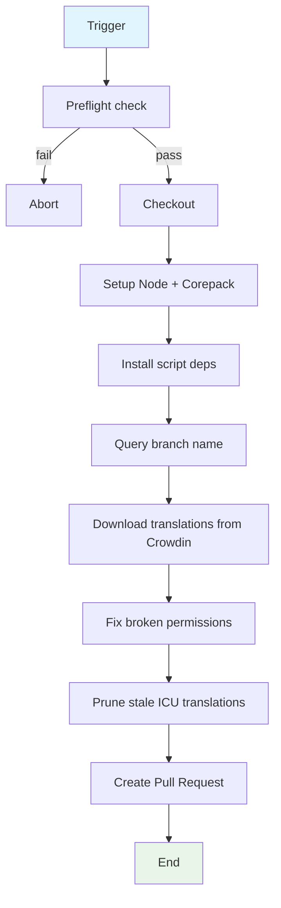

## Workflow Overview

**Purpose**: Download translations from Crowdin and open a PR with updated locale files, pruning stale ICU entries.

**Trigger Events**:
- `schedule` (cron `0 7 * * MON`, every Monday 7 AM)
- `workflow_dispatch`

**Target Environments**: `main` branch only (job guarded by `github.ref == 'refs/heads/main'`).

## Execution Flow Diagram



## Jobs & Dependencies

| Job Name | Purpose | Dependencies | Execution Context |
|----------|---------|--------------|-------------------|
| pull_translations | Pull + open PR | None | `ubuntu-latest` |

## Requirements Matrix

### Functional Requirements

| ID | Requirement | Priority | Acceptance Criteria |
|----|-------------|----------|-------------------|
| REQ-001 | Preflight-verify Crowdin creds present | High | Abort if project id or token missing |
| REQ-002 | Download translations (no source upload) | High | `download_translations=true`, sources/translations upload disabled |
| REQ-003 | Prune stale ICU translations | High | `i18n-icu-contract prune-local` runs |
| REQ-004 | Open a PR with translations | High | `peter-evans/create-pull-request` with `crowdin-pull/<branch>` and label `sync` |

### Security Requirements

| ID | Requirement | Implementation Constraint |
|----|-------------|---------------------------|
| SEC-001 | Crowdin token not logged | Passed via `env` (workflow-level secret) |
| SEC-002 | Only run on main | Job `if` guard |

### Performance Requirements

| ID | Metric | Target | Measurement Method |
|----|-------|--------|-------------------|
| PERF-001 | Weekly cadence | Once per Monday | Schedule compliance |

## Input/Output Contracts

### Inputs

```yaml
# Environment Variables
CROWDIN_PROJECT_ID: variable (vars)  # Purpose: Crowdin project id (also used in preflight check)
CROWDIN_PERSONAL_TOKEN: secret  # Purpose: Crowdin personal access token (also used in preflight)
crowdin_branch_name: string  # Purpose: '[<owner>.<repo>] <safe_branch>' (escaped branch name)

# Triggers
schedule: '0 7 * * MON'
```

### Outputs

```yaml
# Outputs
pull_request: pr  # Description: 'New translations from Crowdin (<branch>)' on branch crowdin-pull/<branch>
locales: files  # Description: updated locale files in PR
```

### Secrets & Variables

| Type | Name | Purpose | Scope |
|------|------|---------|-------|
| Variable | CROWDIN_PROJECT_ID | Crowdin project ID | workflow |
| Secret | CROWDIN_PERSONAL_TOKEN | Crowdin API token | workflow |

## Execution Constraints

### Runtime Constraints

- **Timeout**: Default
- **Concurrency**: workflow `i18n-management` + job group `i18n-pull:<ref>` (cancel-in-progress)
- **Resource Limits**: Minimal

### Environmental Constraints

- **Runner Requirements**: `ubuntu-latest`; Node via `.nvmrc`
- **Network Access**: GitHub, npm registry, Crowdin API
- **Permissions**: `contents: write`, `pull-requests: write`

## Error Handling Strategy

| Error Type | Response | Recovery Action |
|------------|----------|-----------------|
| Missing Crowdin creds | Preflight abort (`exit 1`) | Configure vars/secrets |
| Crowdin download failure | Step fails | Retry workflow_dispatch |
| PR creation conflict | create-pull-request updates existing PR | Re-run |

## Quality Gates

### Gate Definitions

| Gate | Criteria | Bypass Conditions |
|------|----------|-------------------|
| Credentials | Both `CROWDIN_PROJECT_ID` and `CROWDIN_PERSONAL_TOKEN` defined | None |
| ICU freshness | prune-local removes stale keys | None |

## Monitoring & Observability

### Key Metrics

- **Success Rate**: weekly pull PR created
- **Execution Time**: minutes

### Alerting

| Condition | Severity | Notification Target |
|-----------|----------|-------------------|
| Pull failure | Medium | Repo owners |

## Integration Points

### External Systems

| System | Integration Type | Data Exchange | SLA Requirements |
|--------|------------------|---------------|------------------|
| Crowdin | Download | translations | Async, weekly |

### Dependent Workflows

| Workflow | Relationship | Trigger Mechanism |
|----------|--------------|-------------------|
| i18n-push (Crowdin push) | Peer (shared i18n-management concurrency) | Sibling workflow — mutually exclusive via concurrency group |

## Compliance & Governance

### Audit Requirements

- **Execution Logs**: GitHub Actions run logs
- **Approval Gates**: PR review for translations
- **Change Control**: Automated PR

### Security Controls

- **Access Control**: contents + PR write only
- **Secret Management**: token rotates via repo secrets
- **Vulnerability Scanning**: N/A

## Edge Cases & Exceptions

### Scenario Matrix

| Scenario | Expected Behavior | Validation Method |
|----------|-------------------|-------------------|
| Job dispatched on non-main ref | Guarded `if` skips | Trigger on a branch |
| Missing project id/token | Preflight exits 1 with message | Unset one var/secret |
| Crowdin CLI `--all` broken (commented code) | Fake source file workaround commented out | Inspect `Write fake sources` (disabled) |

## Validation Criteria

### Workflow Validation

- **VLD-001**: PR branch `crowdin-pull/<branch>` + title pattern match
- **VLD-002**: `download_translations=true`, upload/push/create_pull_request disabled
- **VLD-003**: `prune-local` reflects ICU contract cleanup

### Performance Benchmarks

- **PERF-001**: Weekly schedule honored

## Change Management

### Update Process

1. **Specification Update**: Modify this document first
2. **Review & Approval**: PR review
3. **Implementation**: Apply changes to workflow
4. **Testing**: workflow_dispatch dry run
5. **Deployment**: Merge to main

### Version History

| Version | Date | Changes | Author |
|---------|------|---------|--------|
| 1.0 | 2026-08-27 | Initial specification (documents `i18n-pull.yml`) | DevOps Team |

## Related Specifications

- [spec-process-cicd-i18n-push.md](./spec-process-cicd-i18n-push.md)
