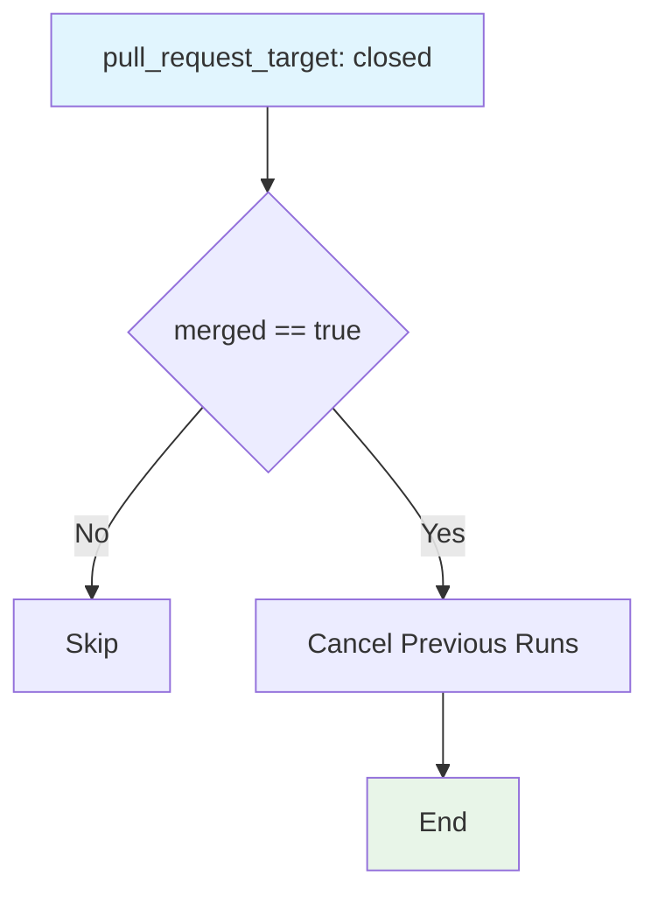

## Workflow Overview

**Purpose**: When a PR is merged, cancel any still-running workflows attached to that PR to free runner resources and avoid stale in-flight runs.

**Trigger Events**: `pull_request_target` with type `closed` (merged only).

**Target Environments**: CI housekeeping (runs on the base branch context via `pull_request_target`).

## Execution Flow Diagram



## Jobs & Dependencies

| Job Name | Purpose | Dependencies | Execution Context |
|----------|---------|--------------|-------------------|
| cancel | Cancel still-running workflows for merged PR | None | `ubuntu-latest` |

## Requirements Matrix

### Functional Requirements

| ID | Requirement | Priority | Acceptance Criteria |
|----|-------------|----------|-------------------|
| REQ-001 | Cancel all workflows of the merged PR | High | `styfle/cancel-workflow-action` with `workflow_id: all`, `ignore_sha: true` |
| REQ-002 | Only act on merges | High | Guarded by `pull_request.merged == true` |

### Security Requirements

| ID | Requirement | Implementation Constraint |
|----|-------------|---------------------------|
| SEC-001 | Needs `actions: write` permission | Explicit `permissions.actions: write` |
| SEC-002 | `pull_request_target` run context | Inherently elevated; restricted to housekeeping action |

### Performance Requirements

| ID | Metric | Target | Measurement Method |
|----|-------|--------|-------------------|
| PERF-001 | Prompt cancellation after merge | Immediate | Run completion |

## Input/Output Contracts

### Inputs

```yaml
# Inputs passed through cancel-workflow-action
workflow_id: 'all'  # Purpose: cancel every workflow for the PR
access_token: GITHUB_TOKEN  # Purpose: actions: write token
ignore_sha: true  # Purpose: match runs by PR number regardless of SHA
pr_number: pull_request.number  # Purpose: identify the merged PR

# Triggers
pull_request_target types: [closed]
```

### Outputs

```yaml
# Side effect
cancelled_runs: count  # Description: cancelled in-flight runs for PR (not summarized explicitly)
```

### Secrets & Variables

| Type | Name | Purpose | Scope |
|------|------|---------|-------|
| Secret | GITHUB_TOKEN | Cancel runs (actions: write) | workflow |

## Execution Constraints

### Runtime Constraints

- **Timeout**: Default
- **Concurrency**: None
- **Resource Limits**: Minimal

### Environmental Constraints

- **Runner Requirements**: `ubuntu-latest`
- **Network Access**: GitHub API
- **Permissions**: `actions: write` (explicit)

## Error Handling Strategy

| Error Type | Response | Recovery Action |
|------------|----------|-----------------|
| Cancel API failure | Step fails (job not on merge-critical path) | Ignorable; rerun optionally |
| Non-merge close | Guarded skip | No action |

## Quality Gates

### Gate Definitions

| Gate | Criteria | Bypass Conditions |
|------|----------|-------------------|
| Merge confirmation | `pull_request.merged == true` only | None |

## Monitoring & Observability

### Key Metrics

- **Success Rate**: cancellation job pass rate

### Alerting

| Condition | Severity | Notification Target |
|-----------|----------|-------------------|
| Cancellation failure | Low (non-critical) | Repo owners |

## Integration Points

### External Systems

| System | Integration Type | Data Exchange | SLA Requirements |
|--------|------------------|---------------|------------------|
| GitHub Actions API | Cancel runs | workflow_id, pr_number, token | Availability |

### Dependent Workflows

| Workflow | Relationship | Trigger Mechanism |
|----------|--------------|-------------------|
| All PR workflows | Targets | Cancels by PR number |

## Compliance & Governance

### Audit Requirements

- **Execution Logs**: GitHub Actions run logs
- **Approval Gates**: None
- **Change Control**: PR review

### Security Controls

- **Access Control**: `pull_request_target` with explicit `actions: write`
- **Secret Management**: Uses GITHUB_TOKEN (auto-rotated)
- **Vulnerability Scanning**: N/A

## Edge Cases & Exceptions

### Scenario Matrix

| Scenario | Expected Behavior | Validation Method |
|----------|-------------------|-------------------|
| Closed-but-not-merged PR | Job skipped | Close a PR without merging |
| Merged PR with running workflows | Runs cancelled via `ignore_sha: true` | Merge and observe cancel |

## Validation Criteria

### Workflow Validation

- **VLD-001**: Cancellation only fires when `merged == true`
- **VLD-002**: `actions: write` permission declared

### Performance Benchmarks

- **PERF-001**: Cancellation completes promptly after merge

## Change Management

### Update Process

1. **Specification Update**: Modify this document first
2. **Review & Approval**: PR review
3. **Implementation**: Apply changes to workflow
4. **Testing**: Merge a PR, observe cancellation
5. **Deployment**: Merge to main

### Version History

| Version | Date | Changes | Author |
|---------|------|---------|--------|
| 1.0 | 2026-08-27 | Initial specification (documents `cancel-pr-workflow-on-merge.yml`) | DevOps Team |

## Related Specifications

- [spec-process-cicd-ci.md](./spec-process-cicd-ci.md)
